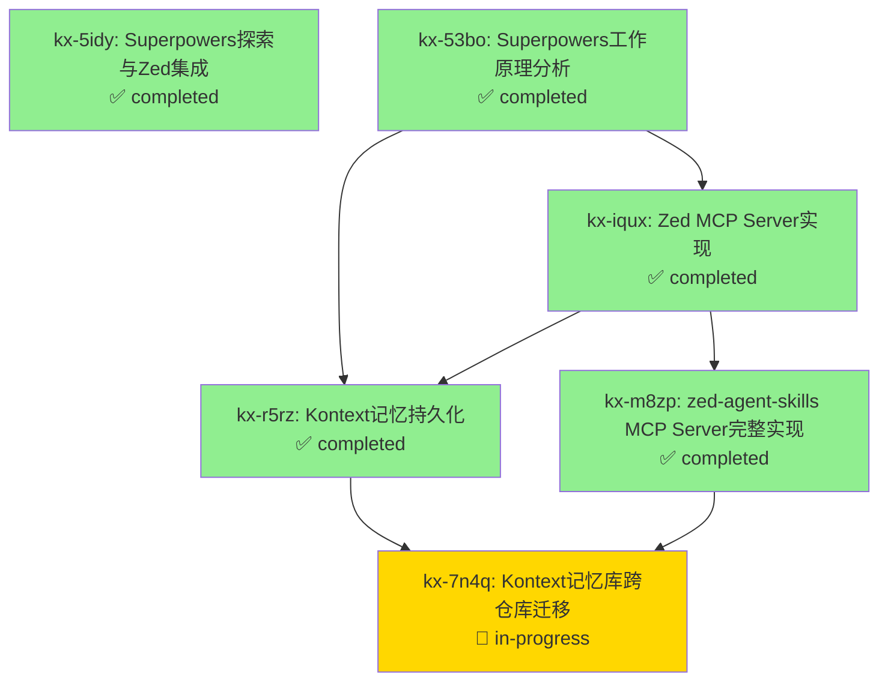

# Kontext 长久记忆 - Zed Agent Skills MCP Server

> **会话 ID**: zed-agent-2026-02-15  
> **项目仓库**: https://github.com/Coffelix2023/zed-agent-skills.git  
> **创建时间**: 2026-02-15 04:05 UTC  
> **迁移时间**: 2026-02-15 04:45 UTC  
> **总任务数**: 6

---

## 📊 依赖关系图



---

## 🎯 核心记忆节点

### [kx-5idy] Superpowers探索与Zed集成 
**状态**: ✅ completed | **优先级**: 🔴 high  
**描述**: 探索 Superpowers 仓库并分析如何集成到 Zed Editor

**关键洞察**:
- Superpowers 本质是 prompt + 环境强制的组合
- Skill 工具通过 MCP 实现动态上下文注入
- Zed 需要 MCP Server 模拟 Claude Code 的 Skill 工具

**标签**: `superpowers`, `zed`, `mcp`, `skill-system`

---

### [kx-53bo] Superpowers工作原理分析
**状态**: ✅ completed | **优先级**: 🔴 high  
**描述**: 深入分析 Superpowers 约束机制

**核心发现**:
1. SessionStart hook 自动注入 using-superpowers
2. Skill 工具动态加载完整 Markdown
3. Red Flags 表预防性驳斥借口
4. HARD-GATE 强制工作流
5. 环境 + prompt 组合实现约束

**关键结论**: Superpowers 不是训练/微调，而是 prompt + 环境强制

**标签**: `superpowers`, `constraint-mechanism`, `prompt-engineering`

---

### [kx-iqux] Zed MCP Server实现
**状态**: ✅ completed | **优先级**: 🔴 high  
**依赖**: kx-53bo  
**描述**: 早期原型 MCP Server (后被 kx-m8zp 替代)

**项目路径**: ~/c6x_local/zed-superpowers-mcp  
**实现**: 基础的 load_skill + list_skills 工具

**标签**: `zed`, `mcp`, `prototype`

---

### [kx-r5rz] Kontext记忆持久化
**状态**: ✅ completed | **优先级**: 🔴 high  
**依赖**: kx-53bo, kx-iqux  
**描述**: 创建双层结构化长久记忆系统

**实现**:
1. Data Layer: `.kontext/issues.jsonl` (JSONL 格式)
2. View Layer: `.kontext/README.md` (Mermaid 依赖图)
3. 哈希 ID (kx-xxxx) 确保零冲突
4. Git 版本控制实现跨会话记忆传递

**标签**: `kontext`, `memory`, `persistence`

---

### [kx-m8zp] zed-agent-skills MCP Server 完整实现 ⭐
**状态**: ✅ completed | **优先级**: 🔥 critical  
**依赖**: kx-iqux  
**描述**: 在新仓库完整开发生产级 MCP Server

**项目信息**:
- **仓库**: https://github.com/Coffelix2023/zed-agent-skills.git
- **路径**: ~/c6x_local/my_apps/MCP/zed-agent-skills
- **版本**: 2.0.0
- **提交**: 24241f9

**核心功能**:
1. ✅ **MCP Prompts API** - `initialize` prompt 注入 using-superpowers
2. ✅ **MCP Tools API** - `load_skill` + `list_skills` 动态加载
3. ✅ **多层目录优先级** - `~/.agents/skills` → `~/.claude/skills`
4. ✅ **支持 29+ skills** - 动态发现与加载
5. ✅ **完整文档** - README + ARCHITECTURE (420+ lines)
6. ✅ **构建系统** - TypeScript + pnpm + 自动化

**技术栈**:
- TypeScript 5.9.3
- @modelcontextprotocol/sdk 1.26.0
- Node.js v18+
- pnpm 包管理

**文件结构**:
```
zed-agent-skills/
├── src/index.ts          (305 lines)
├── docs/ARCHITECTURE.md  (215 lines)
├── build/index.js        (9.3KB 可执行文件)
├── README.md
├── package.json
├── tsconfig.json
└── .kontext/             (本记忆库)
```

**标签**: `mcp`, `zed`, `typescript`, `prompts`, `tools`, `production-ready`

---

### [kx-7n4q] Kontext 记忆库跨仓库迁移
**状态**: 🔄 in-progress | **优先级**: 🔴 high  
**依赖**: kx-r5rz, kx-m8zp  
**描述**: 将记忆库迁移到新仓库并更新上下文

**迁移原因**:
- MCP Server 独立仓库需要独立记忆
- 跨会话记忆传递
- 便于项目维护与文档化

**迁移步骤**:
1. ✅ 复制 `.kontext/` 目录
2. ✅ 新增 kx-m8zp 节点（记录 MCP 完整实现）
3. ✅ 新增 kx-7n4q 节点（记录本次迁移）
4. 🔄 更新 README.md（新仓库上下文）
5. ⏳ 更新 QUICKREF.md（快速参考）
6. ⏳ Git 提交（确保持久化）

**标签**: `kontext`, `migration`, `memory-transfer`, `cross-repo`

---

## 📌 下一步行动

### 立即任务
1. ✅ 完成 README.md 更新
2. ⏳ 完成 QUICKREF.md 更新
3. ⏳ Git 提交记忆库
4. ⏳ 配置 Zed settings.json
5. ⏳ 验证 MCP Server 运行
6. ⏳ 测试完整工作流

### 验证清单
- [ ] MCP Server 在 Zed 中显示绿点
- [ ] `initialize` prompt 成功注入 using-superpowers
- [ ] `load_skill` 工具正常加载 skills
- [ ] `list_skills` 工具列出 29+ skills
- [ ] Agent 遵循 Superpowers 工作流

---

## 🔑 关键技术栈

- **MCP (Model Context Protocol)**: 自定义工具协议
- **Zed Editor**: AI-first 代码编辑器
- **TypeScript**: 类型安全的开发体验
- **Superpowers**: Skill-based 工作流系统
- **Kontext**: 双层结构化记忆系统

---

## 📝 元数据

- **会话窗口**: Zed Agent
- **Agent**: Claude Sonnet 4.5
- **用户**: Felix (@Coffelix2023)
- **项目**: zed-agent-skills MCP Server
- **原始会话**: 2026-02-15 04:05 UTC
- **迁移时间**: 2026-02-15 04:45 UTC
- **记忆保留**: 完整历史 (kx-5idy → kx-7n4q)
